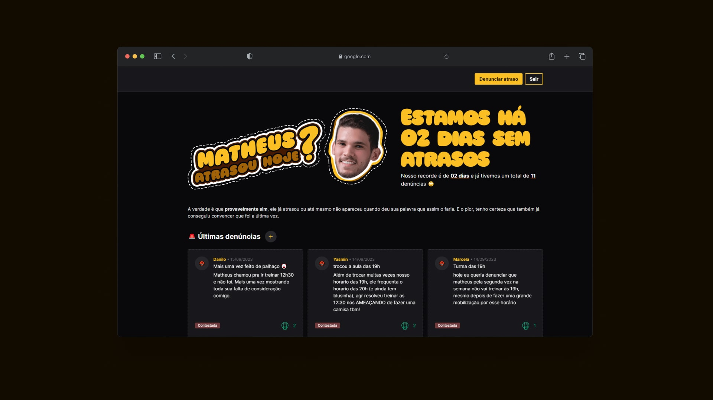

# Matheus Atrasou Hoje?

Essa aplicação é fruto de uma brincadeira entre amigos que estavam cansados dos incontáveis atrasos de Matheus. Denunciando o comportamento dele podemos incentivar que ele não o repita e também desabafar momentos que ele nos fez passar raiva.

## Demo


🚀 Você pode conferir a [versão de desenvolvimento da aplicação](https://matheus-atrasou-hoje-staging.fly.dev/).

## Tech Stack

- [Remix Indie Stack](https://github.com/remix-run/indie-stack) como base inicial do projeto
- Static Types with TypeScript
- Styling with Tailwind
- Database ORM with Prisma
- Production-ready SQLite Database
- GitHub Actions for deploy on merge to production and staging environments
- Code formatting with Prettier
- Linting with ESLint

## Lições Aprendidas

Esse foi um projeto desafiador por ter sido a primeira vez que trabalhava com praticamente todas as tecnologias em um projeto "real" que foi criado na minha cabeça para uma necessidade invidual da minha rotina. Entre os maiores lições estão:

- Aprender como funciona uma **autenticação baseada em cookies**, usando as ferramentas auxiliares do Remix.
- Trabalhar usando mais o lado do **servidor**, que é o coração da filosofia do Remix.
- Pesquisar e aprender como fazer a **tipagem** de vários pontos da aplicação. Especialmente na utilização de generics para flexibilizar o código e as abstrações.
- Desenhar um banco de dados simples, mas que já foi possível notar pontos que poderiam ser melhorados.
- Deploy da aplicação em dois ambientes distintos e de forma continuada e integrada.

## Environment Variables

Para rodar a aplicação você precisa fornecer as seguintes variávies, use como base o arquivo `env.example` para criação do seu `.env`.

```
DATABASE_URL="file:./data.db?connection_limit=1"
SESSION_SECRET="super-duper-s3cret"
DEFENDANT_USER_EMAIL="rachel@remix.run"
```

A variável `DEFENDANT_USER_EMAIL` é utilizada para fornecer um badge de verificação para o amigo que está sendo vítima das denúncias e também destacar quando ele fez algum comentário se defendendo de uma das acusações.

## Run Locally

Clone the project

```bash
  git clone git@github.com:odanilo/matheus-atrasou-hoje.git
```

Go to the project directory

```bash
  cd my-project
```

Create the `.env` file

```bash
cp .env.example .env
```

Install dependencies

```bash
  npm install
```

Setup database and seed it

```bash
npm run setup
```

Start the server

```bash
  npm run dev
```

Isso irá inicializar o servidor de desenvolvimento que, a cada mudança de arquivo, irá remontar a aplicação e seus recursos.

O arquivo de `seed` do banco de dados irá criar um novo usuário e popular as tabelas com alguns atrasos. Esse é o usuário criado:

- Email: rachel@remix.run
- Password: racheliscool

## Deployment

Para configurar deploy da aplicação, você pode seguir os passos abaixo, retirados da documentação do [Indie Stack do Remix](https://github.com/remix-run/indie-stack):

This Remix Stack comes with two GitHub Actions that handle automatically deploying your app to production and staging environments.

Prior to your first deployment, you'll need to do a few things:

- [Install Fly](https://fly.io/docs/getting-started/installing-flyctl/)

- Sign up and log in to Fly

  ```sh
  fly auth signup
  ```

  > **Note:** If you have more than one Fly account, ensure that you are signed into the same account in the Fly CLI as you are in the browser. In your terminal, run `fly auth whoami` and ensure the email matches the Fly account signed into the browser.

- Create two apps on Fly, one for staging and one for production:

  ```sh
  fly apps create indie-stack-template
  fly apps create indie-stack-template-staging
  ```

  > **Note:** Make sure this name matches the `app` set in your `fly.toml` file. Otherwise, you will not be able to deploy.

  - Initialize Git.

  ```sh
  git init
  ```

- Create a new [GitHub Repository](https://repo.new), and then add it as the remote for your project. **Do not push your app yet!**

  ```sh
  git remote add origin <ORIGIN_URL>
  ```

- Add a `FLY_API_TOKEN` to your GitHub repo. To do this, go to your user settings on Fly and create a new [token](https://web.fly.io/user/personal_access_tokens/new), then add it to [your repo secrets](https://docs.github.com/en/actions/security-guides/encrypted-secrets) with the name `FLY_API_TOKEN`.

- Add a `SESSION_SECRET` to your fly app secrets, to do this you can run the following commands:

  ```sh
  fly secrets set SESSION_SECRET=$(openssl rand -hex 32) --app indie-stack-template
  fly secrets set SESSION_SECRET=$(openssl rand -hex 32) --app indie-stack-template-staging
  ```

  If you don't have openssl installed, you can also use [1Password](https://1password.com/password-generator) to generate a random secret, just replace `$(openssl rand -hex 32)` with the generated secret.

- Create a persistent volume for the sqlite database for both your staging and production environments. Run the following:

  ```sh
  fly volumes create data --size 1 --app indie-stack-template
  fly volumes create data --size 1 --app indie-stack-template-staging
  ```

Now that everything is set up you can commit and push your changes to your repo. Every commit to your `main` branch will trigger a deployment to your production environment, and every commit to your `dev` branch will trigger a deployment to your staging environment.

### Connecting to your database

The sqlite database lives at `/data/sqlite.db` in your deployed application. You can connect to the live database by running `fly ssh console -C database-cli`.

### Getting Help with Deployment

If you run into any issues deploying to Fly, make sure you've followed all of the steps above and if you have, then post as many details about your deployment (including your app name) to [the Fly support community](https://community.fly.io). They're normally pretty responsive over there and hopefully can help resolve any of your deployment issues and questions.

## GitHub Actions

We use GitHub Actions for continuous integration and deployment. Anything that gets into the `main` branch will be deployed to production after running tests/build/etc. Anything in the `dev` branch will be deployed to staging.

## Feedback

Se você tem algum feedback, fique a vontade para entrar em contato, criar um issue ou mandar um e-mail para dan.nunes0@gmail.com 🤝

---

---

\
Feito com 💜 e um pouco de raiva desse amigo.
